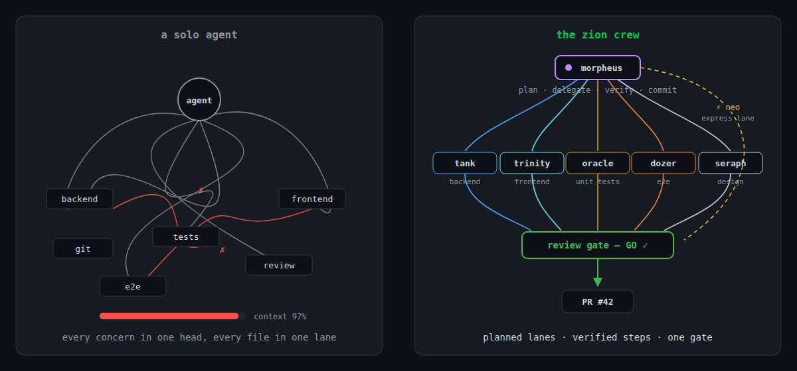

# Zion

<!-- Release-tag scheme is `plugin/vX.Y.Z` (see auto-release.yml). The label is
     blanked (`&label=`) so each badge is a single pill of the tag itself — which
     already names the plugin — instead of doubling it up as "crew crew/v3.5.2". -->
[](https://github.com/johantor/zion/releases)
[](https://github.com/johantor/zion/releases)
[](https://github.com/johantor/zion/releases)
[](https://github.com/johantor/zion/actions/workflows/validate.yml)
[](LICENSE)

**Ship features like a crew, not a single agent.** Zion is a
[Claude Code](https://code.claude.com/docs/en/overview) plugin marketplace for
team-style software delivery: a captain that plans and delegates to backend,
frontend, test, and design specialists behind hook-enforced guardrails
(**crew**), a precision tool that pays down tech debt and upgrades dependencies
one verified fix at a time (**keymaker**), and the shared review rubric behind
both (**engineering-principles**) — installable together or independently.

```bash
claude plugin marketplace add johantor/zion
claude plugin install crew@zion
```

<!-- Illustration source: docs/solo-vs-crew.svg (edit the SVG, then re-export the PNG).
     A terminal-style animation of a /crew:feature run also lives at docs/demo.gif. -->


## Plugins

| Plugin | Status | What it does | Adds to your session |
|---|---|---|---|
| **[crew](plugins/crew/README.md)** | Stable | Orchestrated, multi-agent feature delivery: a captain (`morpheus`) plans the work and delegates to backend, frontend, test, and visual-review specialists, with a consolidated review gate before anything ships. | `/crew:*` commands, agents, safety hooks, skills |
| **[keymaker](plugins/keymaker/README.md)** | Beta | Pointer-driven tech debt remediation and dependency upgrades: fix one suppression, rule, or package at a time, with a blast-radius gate before anything moves. | `/keymaker:*` commands, agents, safety hooks, skills |
| **[engineering-principles](plugins/engineering-principles/README.md)** | Stable | The code-review rubric used across the suite, packaged standalone for teams who only want the standards. | One skill — no commands, agents, or hooks |

The plugins are designed to compose: they share the same `CLAUDE.md`
configuration slots and the same review rubric, so installing more than one adds
capability without conflicts. `crew` already bundles the `engineering-principles`
rubric — install the standalone plugin only if you *don't* use `crew`.

## Requirements

- [Claude Code](https://code.claude.com/docs/en/overview) with plugin support
  (CLI, desktop, or IDE extension).
- A git repository — `crew` and `keymaker` branch and commit their work.
- Optional, for `crew`'s visual review and PR workflows: Playwright, Figma, and
  GitHub / Azure DevOps MCP servers. Setup is documented in the
  [crew README](plugins/crew/README.md); everything else works without them.

## Installation

Add the marketplace once:

```bash
claude plugin marketplace add johantor/zion
```

Then install the plugins you want:

```bash
claude plugin install crew@zion
claude plugin install keymaker@zion
claude plugin install engineering-principles@zion   # only if you don't use crew
```

Alternatively, install from the UI: run `/plugin` in Claude Code and browse to
**Discover**.

## Quick start

### crew — build a feature

```bash
claude --agent crew:morpheus     # dedicated orchestration session — just describe the feature
```

or, from a normal session:

```
/crew:init                 # once per project: detect and record build/test/lint config
/crew:feature <task>       # plan, delegate, build — stops at the review gate
/crew:review               # pre-PR GO / NO-GO: code + security + design review, build/test/lint
/crew:pr                   # push the branch and open the pull request
/crew:address              # route PR comments and CI failures back to the crew
```

`morpheus` presents its plan before building, commits each verified step to a
feature branch, and runs workers in the background so you can keep talking to it
mid-flight. Nothing is pushed and no PR is opened until you say so.

### keymaker — fix debt, one pointer at a time

```
/keymaker:open src/Orders/OrderService.cs:42    # a suppression at a specific line
/keymaker:open CS8602                           # every suppression of a rule
/keymaker:open eslint no-explicit-any           # an ESLint rule
/keymaker:open Newtonsoft.Json 13.x             # a dependency upgrade
/keymaker:audit <scope>                         # read-only scout: returns ready-to-paste pointers
```

Each fix is classified, gated on its blast radius, fixed in verified batches,
and committed per batch — the deleted suppression makes the analyzer itself the
regression test. Supports .NET / C# and TypeScript / JavaScript today.

### engineering-principles — the rubric, standalone

No commands to learn: once installed, Claude Code loads the skill automatically
and applies it when you write, refactor, or review code.

## Updating and uninstalling

```bash
claude plugin marketplace update zion    # refresh the plugin catalog
claude plugin update crew@zion           # update an installed plugin
claude plugin uninstall crew@zion        # remove a plugin
```

Release notes: [crew](plugins/crew/CHANGELOG.md) ·
[keymaker](plugins/keymaker/CHANGELOG.md) ·
[engineering-principles](plugins/engineering-principles/CHANGELOG.md).

## Documentation

- [crew](plugins/crew/README.md) — agents, commands, hooks, background
  delegation, and optional MCP setup.
- [keymaker](plugins/keymaker/README.md) — pointer syntax, the fix pipeline,
  and audit scopes.
- [engineering-principles](plugins/engineering-principles/README.md) — what the
  rubric covers.
- [AGENTS.md](AGENTS.md) — contributing a plugin or hacking on the crew.

## License

[Apache-2.0](LICENSE)

---

<details>
<summary>Trivia — what's with the names?</summary>

Everything here is named from *The Matrix*. **Zion** is humanity's last city — the home
that houses the resistance, and a fitting name for a marketplace of crews. The agents are
mapped loosely to what they do:

- **morpheus** — the captain: plans and leads, writes no code himself (crew orchestrator).
- **neo** — "The One," not bound to a single role: the generalist who takes the express lane for small fixes.
- **tank** & **dozer** — the operators: **tank** runs the backend, **dozer** runs the e2e tests.
- **trinity** — the hacker on point: the frontend.
- **oracle** — sees what will and won't hold up: the unit tests (backend, plus frontend component tests).
- **seraph** — the guardian who knows you by testing you ("you do not truly know someone until you fight them"): visual design conformance.
- **keymaker** — "I make the keys": opens locked doors one at a time, with precision (tech debt and upgrades orchestrator).
- **twin** — the keymaker's mechanical fixer/runner; works in pairs, in parallel.

</details>
